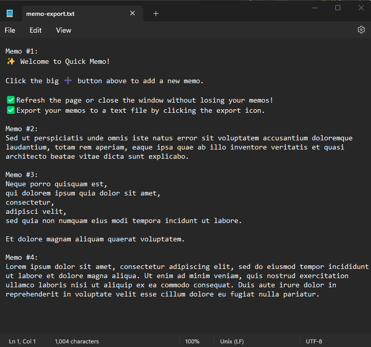

# Quick Memo React App
Quick Memo is a Single Page Application (SPA) made with React for quick note-taking.
This project was bootstrapped with [Create React App](https://github.com/facebook/create-react-app).


## ✅ Features
- 🌙 <b>Dark Mode toggle </b>
  - Uses system setting on initial load.
- 📦 <b>Memo data kept in localStorage </b>
  - Refresh the page or close the browser window without losing existing memos.
- 📤 <b>Export to text file</b> 
  - Click on the export icon on the navigation bar to export all memos into a text file.

The memos will be reorganized according to responsive design on the page:


On Smaller screens:


Exported memos in text file preview:



## ✨ Getting Started
- Fork and clone this repo.
- Run  ```npm install``` in the root directory of the project to install dependencies.
- Run ```np start```

## 🔧 Technical Specifications
- <a href="https://reactjs.org/"> React</a>
- <a href="https://reactjs.org/docs/create-a-new-react-app.html#gatsby-focus-wrapper"> Create React App</a>
- <a href="https://webpack.js.org/"> Webpack</a>
- <a href="https://babeljs.io/"> Babel</a>
- <a href="https://sass-lang.com/documentation/"> Sass</a>
- <a href="https://mui.com/material-ui/"> Material UI (MUI)</a>
- <a href="https://www.npmjs.com/package/file-saver"> file-saver </a> (Solution to saving files on the client-side)